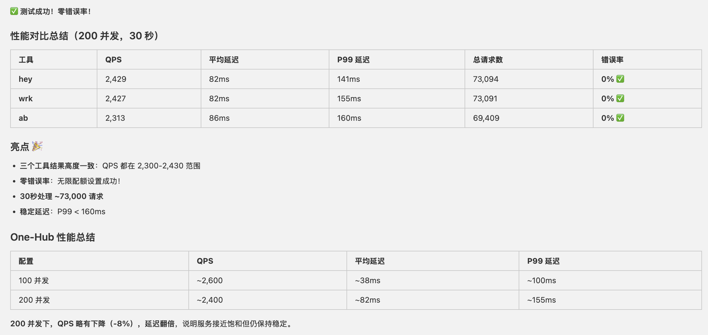
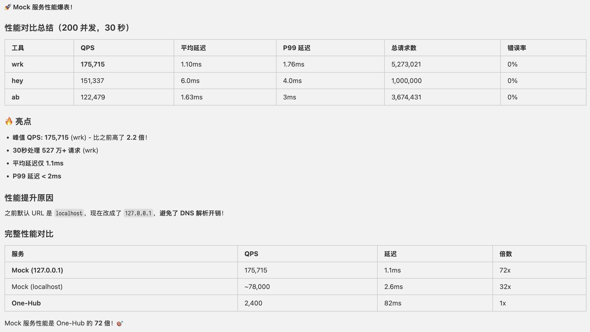

# 性能测试结果

## 测试环境

- M4 Macbook Air 32G

## 结论

- Mac 上的虚拟机性能损耗还是较大
- Mock(127.0.0.1) ： 是 native arm 的 mock 程序
- Mock (localhost) ： 是 x64 的 mock 跑在 linux VM 中
- One-Hub ： one-hub 和 mock 均跑在 linux VM 中，但因为性能差距太大，mock 的消耗可以忽略

最终结论：one-hub 达到了 k 级别的 QPS，如果加上负载均衡，满足我们的业务需求没有问题
